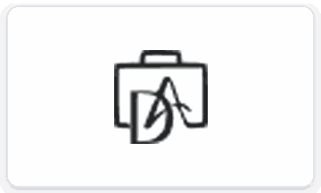
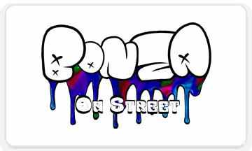

<h1 align="center">Hello World!  I'm Nachiket Soni</h1>
<h3 align="center">Software Engineer | Full Stack Developer | React Developer | Node Developer </h3>

<picture>
  <source media="(prefers-color-scheme: dark)" srcset="https://raw.githubusercontent.com/nachiketsoni/nachiketsoni/output/github-snake-dark.svg" />
  <source media="(prefers-color-scheme: light)" srcset="https://raw.githubusercontent.com/nachiketsoni/nachiketsoni/output/github-snake.svg" />
  
</picture>
  
## 👨‍💻 About Me
Full Stack Developer with 10+ projects delivered, 3+ years of hands-on experience, and a focus on building high-quality digital solutions that drive real business impact.
### 🚀 Current Focus  
- 🔧 Developing scalable backend systems and RESTful APIs  
- 🛠️ Optimizing database performance and real-time data processing  
- 🎯 Exploring & Improving skills on Blockchain and Other Skills
- 🌐 Building dynamic and responsive front-end experiences with React  
- 📊 Learning **System Design** to architect scalable and efficient solutions

## 💼 Work

<table>
  <tr>
    <td align="center" valign="top">
      <a href="https://wewonacademy.co" title="We Won Academy">
        <picture>
          <source media="(prefers-color-scheme: dark)" srcset="./logos/dark/wewon.png">
          <source media="(prefers-color-scheme: light)" srcset="./logos/light/wewon.png">
          
        </picture>
      </a>
      <br>
      <a href="https://wewonacademy.co"><b>We Won Academy</b></a>
    </td>
    <td align="center" valign="top">
      <a href="https://victorify.in" title="Victorify">
        <picture>
          <source media="(prefers-color-scheme: dark)" srcset="./logos/dark/victorify.png">
          <source media="(prefers-color-scheme: light)" srcset="./logos/light/victorify.png">
          
        </picture>
      </a>
      <br>
      <a href="https://victorify.in"><b>Victorify</b></a>
    </td>
    <td align="center" valign="top">
      <a href="https://bridgpoint.com" title="Bridgpoint">
        <picture>
          <source media="(prefers-color-scheme: dark)" srcset="./logos/dark/bridgpoint.png">
          <source media="(prefers-color-scheme: light)" srcset="./logos/light/bridgpoint.png">
          
        </picture>
      </a>
      <br>
      <a href="https://bridgpoint.com"><b>Bridgpoint</b></a>
    </td>
  </tr>
  <tr>
    <td align="center" valign="top">
      <a href="https://sahiraste.com" title="Sahi Raste">
        <picture>
          <source media="(prefers-color-scheme: dark)" srcset="./logos/dark/sahiraste.png">
          <source media="(prefers-color-scheme: light)" srcset="./logos/light/sahiraste.png">
          
        </picture>
      </a>
      <br>
      <a href="https://sahiraste.com"><b>Sahi Raste</b></a>
    </td>
    <td align="center" valign="top">
      <a href="https://seatsarthi.com" title="Seat Sarthi">
        <picture>
          <source media="(prefers-color-scheme: dark)" srcset="./logos/dark/seatsarthi.png">
          <source media="(prefers-color-scheme: light)" srcset="./logos/light/seatsarthi.png">
          
        </picture>
      </a>
      <br>
      <a href="https://seatsarthi.com"><b>Seat Sarthi</b></a>
    </td>
    <td align="center" valign="top">
      <a href="https://broyal.com" title="Broyal">
        <picture>
          <source media="(prefers-color-scheme: dark)" srcset="./logos/dark/broyal.png">
          <source media="(prefers-color-scheme: light)" srcset="./logos/light/broyal.png">
          
        </picture>
      </a>
      <br>
      <a href="https://broyal.com"><b>Broyal</b></a>
    </td>
  </tr>
  <tr>
    <td align="center" valign="top">
      <a href="https://apps.apple.com/in/app/dandy-agents/id6502832613?l=hi&amp;platform=watch" title="Dandy Agent">
        <picture>
          <source media="(prefers-color-scheme: dark)" srcset="./logos/dark/dandy.png">
          <source media="(prefers-color-scheme: light)" srcset="./logos/light/dandy.png">
          
        </picture>
      </a>
      <br>
      <a href="https://apps.apple.com/in/app/dandy-agents/id6502832613?l=hi&amp;platform=watch"><b>Dandy Agent</b></a>
    </td>
    <td align="center" valign="top">
      <a href="https://sageeuphoria.vercel.app" title="Sage Euphoria">
        <picture>
          <source media="(prefers-color-scheme: dark)" srcset="./logos/dark/sageeuphoria.png">
          <source media="(prefers-color-scheme: light)" srcset="./logos/light/sageeuphoria.png">
          
        </picture>
      </a>
      <br>
      <a href="https://sageeuphoria.vercel.app"><b>Sage Euphoria</b></a>
    </td>
    <td align="center" valign="top">
      <a href="https://bonza.vercel.app" title="Bonza On Street">
        <picture>
          <source media="(prefers-color-scheme: dark)" srcset="./logos/dark/bonza.png">
          <source media="(prefers-color-scheme: light)" srcset="./logos/light/bonza.png">
          
        </picture>
      </a>
      <br>
      <a href="https://bonza.vercel.app"><b>Bonza On Street</b></a>
    </td>
  </tr>
</table>

<p align="right"><sub>09 SELECTED PROJECTS · 2026</sub></p>


## 🛠️ Tech Stack

```javascript
const techStack = {
  full_stack: ["Next"],
  frontend: ["React", "Astro", "Angular", "Material-UI", "Tailwind CSS", "HTML", "CSS"],
  backend: ["Node","Nest.js", "Express","Fastify"],
  database: ["MongoDB", "MySQL", "Oracle"],
  caching: ["Redis"],
  blockchain: ["Solidity"],
  mobile: ["React Native"],
  ui_ux: ["Figma", "Adobe XD"],
  tools: ["Git", "Docker", "CI/CD", "Firebase", "AWS", "Postman" ],
  architecture: ["MVC", "Monolithic Architecture", "Microservices"],
  programming_language: ["javascript", "typescript", "python"],
  AI: ["OpenAI", "ChatGPT", "Codex", "Claude Code", "Antigravity", "Gemini CLI", "GitHub Copilot","Lovable", "Emergent" ]
};
```


<details>
<summary> 
📊 GitHub Statistics
</summary>
<!-- START_SECTION:github_stats -->

> Last updated: 21/08/2026 at 06:47AM IST

📈 **Activity Overview**
- 💻 Total Commits: 2260
- ⭐ Total Stars Earned: 1
- 🔀 Pull Requests: 106
- 📝 Issues Created: 0
- 📦 Repositories: 89

🔝 **Most Used Languages**

- JavaScript: 40 repos

- TypeScript: 23 repos

- HTML: 7 repos

- Python: 6 repos

- CSS: 4 repos

- EJS: 4 repos

- Solidity: 1 repos

- Astro: 1 repos
 
<!-- END_SECTION:github_stats -->
</p>
</details>


<!-- <div align="center">
  <a href="https://open.spotify.com/user/q30xf7s1lenc38r3eqi9jte5i">
    
  </a>
</div> -->

